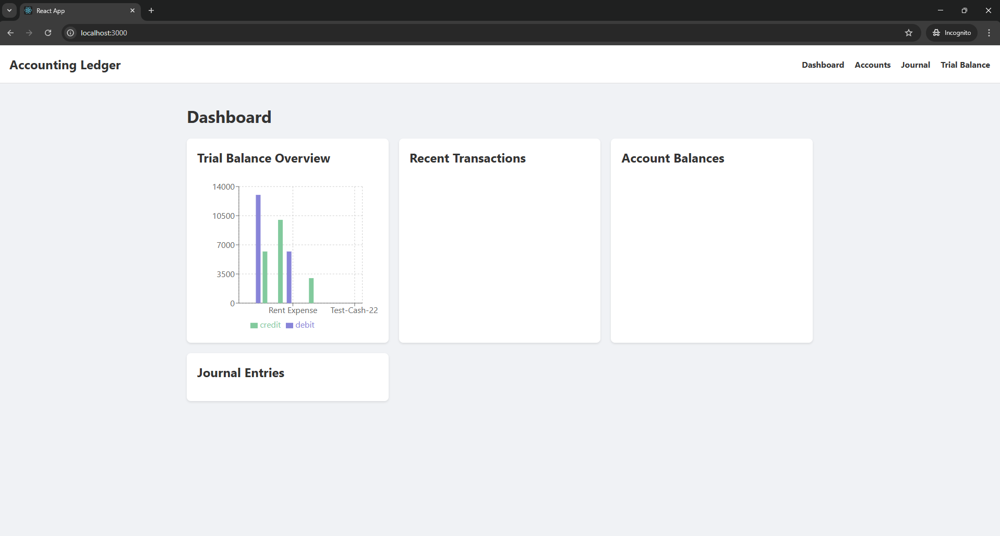
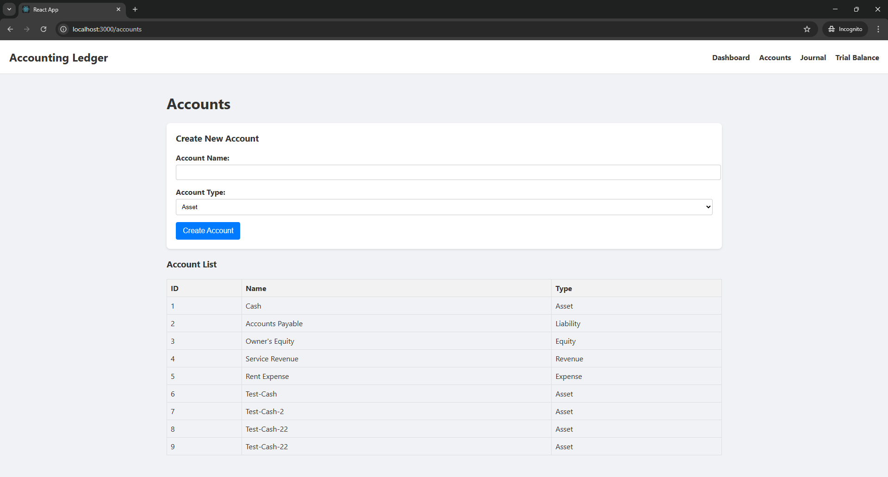
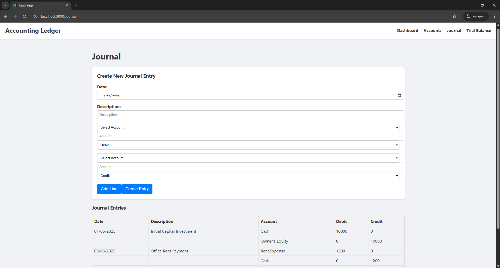
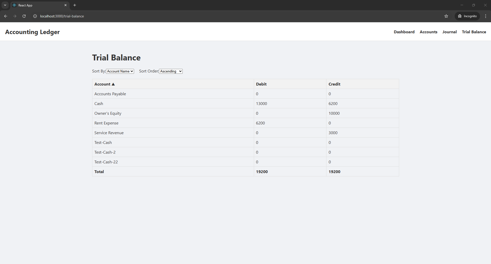

# Modular Accounting Ledger System

A professional-grade, modular accounting ledger system built using **ASP.NET Core Web API**, **React.js**, **SQL Server (via Stored Procedures)**, and **Clean Architecture** principles. It supports CRUD for accounts, double-entry journal entries, and trial balance reports — complete with filtering, sorting, pagination, validation, and API documentation.

---

## 🏗️ Project Structure

```
ModularAccountingLedger/
├── AccountingLedger.API               # Web API entry point
├── AccountingLedger.Application       # Business rules, CQRS, validation
├── AccountingLedger.Domain            # Core entities
├── AccountingLedger.Infrastructure    # EF Core + Stored Procedure repos
├── AccountingLedger.React             # React + Bootstrap frontend
├── DatabaseScripts/                   # SQL schema + stored procedures
```

---

## ⚙️ Technologies Used

| Area        | Tech Stack                               |
|-------------|-------------------------------------------|
| Backend     | ASP.NET Core (.NET 7+)                    |
| Frontend    | React.js, Bootstrap 5                     |
| ORM         | EF Core + ADO.NET (stored procedure access) |
| DB Engine   | SQL Server                                |
| Validation  | FluentValidation + MediatR pipeline        |
| API Docs    | Swagger / OpenAPI                         |
| Architecture| Clean Architecture (Onion-style)          |
| Cross-Origin| CORS (localhost:3000 to 5000)              |

---

## 🚀 Getting Started

### ✅ Prerequisites

- [.NET 7+ SDK](https://dotnet.microsoft.com/en-us/download)
- [SQL Server](https://www.microsoft.com/en-us/sql-server/sql-server-downloads)
- [Node.js (v18+)](https://nodejs.org)
- [npm](https://www.npmjs.com/)

---

### 1. 📥 Clone the Repository

```bash
git clone https://github.com/your-org/ModularAccountingLedger.git
cd ModularAccountingLedger
```

---

### 2. 🧱 Database Setup

1. Create a SQL Server database: `AccountingLedgerDB`
2. Run all `.sql` files in `/DatabaseScripts/` to:
   - Create tables
   - Create stored procedures
   - Seed default data (optional)

---

### 3. 🚦 Run Backend (API)

```bash
cd AccountingLedger.API
dotnet restore
dotnet run
```

- App runs at: `http://localhost:5000`
- Swagger UI: `http://localhost:5000/swagger`

---

### 4. 🎨 Run Frontend (React)

```bash
cd AccountingLedger.React
npm install
npm start
```

- React dev server: `http://localhost:3000`

---

## 🧾 Stored Procedures Used

| Procedure Name             | Purpose                                      |
|---------------------------|----------------------------------------------|
| `usp_AddAccount`          | Inserts a new account into the system        |
| `usp_GetAccounts`         | Returns all accounts                         |
| `usp_AddJournalEntry`     | Adds a new journal entry header              |
| `usp_AddJournalEntryLine` | Adds debit/credit lines linked to an entry   |
| `usp_GetJournalEntries`   | Retrieves journal entries with account lines |
| `usp_GetTrialBalance`     | Returns account-wise debit/credit summary    |

---

## 🧪 Validation Rules

### 🔹 Create Account
- Name: required, max 100 chars
- Type: must be one of `Asset`, `Liability`, `Equity`, `Revenue`, `Expense` (case-insensitive)

### 🔹 Create Journal Entry
- Must contain ≥2 lines
- Each line: debit or credit (not both)
- Sum of debit = sum of credit

---

## ⚙️ EF Core Migrations (Optional Setup)

If using EF Core to create schema:

### 📦 Install EF Core CLI

```bash
dotnet tool install --global dotnet-ef
```

### 🔧 Create a Migration

```bash
dotnet ef migrations add InitialCreate --project AccountingLedger.Infrastructure --startup-project AccountingLedger.API
```

### 🏗️ Apply Migration

```bash
dotnet ef database update --project AccountingLedger.Infrastructure --startup-project AccountingLedger.API
```

---

## ⚠️ CORS Setup

CORS allows React (`localhost:3000`) to call API (`localhost:5000`).  
Configured in `Program.cs`:

```csharp
builder.Services.AddCors(options =>
{
    options.AddPolicy("AllowFrontend",
        policy => policy.WithOrigins("http://localhost:3000")
                        .AllowAnyHeader()
                        .AllowAnyMethod());
});
```

---

## 📌 Future Improvements

- [ ] Authentication + Role-based access
- [ ] Export to Excel/PDF
- [ ] Docker-based deployment
- [ ] Audit trail and logs
- [ ] Frontend state with Zustand or Redux

---

## 🧑‍💻 Author

**Your Name** – _Full-stack .NET Developer_  
📧 email@example.com  
🔗 [LinkedIn](https://linkedin.com/in/yourname)

---

## 📝 License

This project is licensed under the **MIT License** — feel free to use and adapt.

---

## 📦 Version

**v1.0.0** – Stable

---

## 📸 UI Screenshots

### 🧭 Dashboard



### ➕ Create Account



### 🧾 Journal Entry



### 📊 Trial Balance Report


